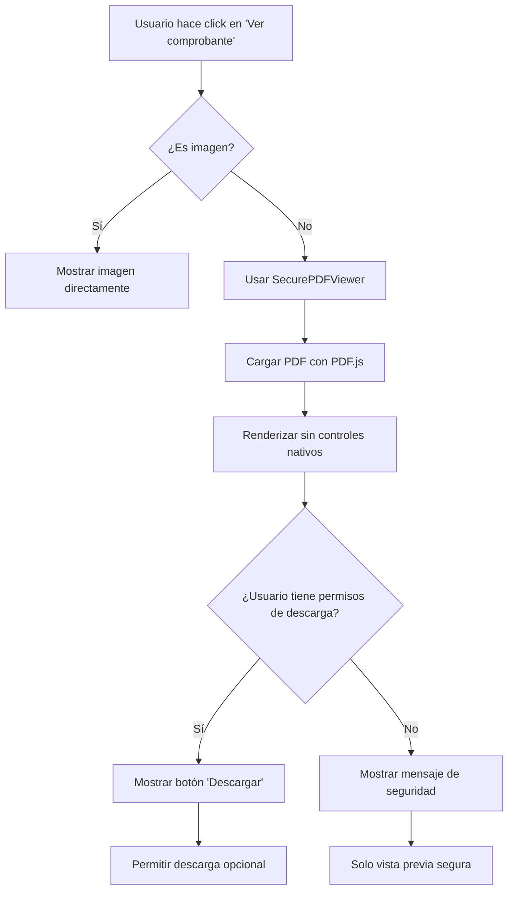

# 🔐 Sistema de Seguridad para Comprobantes - DR Group Dashboard

## 📋 Resumen de Implementación

Se ha implementado un sistema de seguridad robusto para el manejo de comprobantes de pago con las siguientes características:

### 🛡️ **1. Sistema de Permisos Granulares**

#### **Permisos Disponibles:**
- `DOWNLOAD_RECEIPTS`: Descargar comprobantes
- `VIEW_RECEIPTS`: Ver comprobantes
- `UPLOAD_RECEIPTS`: Subir comprobantes
- `DELETE_RECEIPTS`: Eliminar comprobantes
- Y más permisos para otras funcionalidades...

#### **Configuración Temporal (Hasta implementar gestión de usuarios):**
```javascript
// En src/utils/userPermissions.js
const usersWithDownloadPermissions = [
  'admin@drgroup.com',
  'gerente@drgroup.com',
  'diego@drgroup.com' // Agregar emails que deben tener permisos
];
```

### 🔒 **2. Vista Previa Segura de PDFs**

#### **Características del SecurePDFViewer:**
- ✅ **Sin barra de descarga nativa**: Usa PDF.js para renderizar sin controles del navegador
- ✅ **Controles personalizados**: Navegación, zoom, rotación controlados por la aplicación
- ✅ **Prevención de descarga**: No se puede hacer clic derecho → guardar como
- ✅ **Vista previa completa**: Visualización de todas las páginas con controles de navegación

#### **Componente Creado:**
```jsx
<SecurePDFViewer 
  url={existingReceiptUrl}
  height={500}
  allowControls={true}
  onError={(error) => console.error('Error loading PDF:', error)}
/>
```

### 🎯 **3. Experiencia de Usuario Mejorada**

#### **Para usuarios CON permisos de descarga:**
- ✅ Ven el botón "Descargar" en el modal de vista previa
- ✅ Pueden descargar el archivo si realmente lo necesitan

#### **Para usuarios SIN permisos de descarga:**
- ✅ Ven una alerta informativa: "No tienes permisos para descargar archivos"
- ✅ Pueden ver el contenido completo del PDF de forma segura
- ❌ No pueden descargar ni acceder a controles nativos del navegador

### 📱 **4. Flujo de Seguridad Implementado**



## 🚀 **Implementación Actual**

### **Archivos Creados/Modificados:**

1. **`src/utils/userPermissions.js`** - Sistema de permisos granulares
2. **`src/components/common/SecurePDFViewer.jsx`** - Visor PDF seguro
3. **`src/components/commitments/PaymentPopupPremium.jsx`** - Modal actualizado con seguridad

### **Configuración Inmediata:**

Para configurar qué usuarios pueden descargar archivos, edita la lista en `userPermissions.js`:

```javascript
const usersWithDownloadPermissions = [
  'tu-email@empresa.com',  // ← Agregar emails autorizados
  'gerente@empresa.com',
  'admin@empresa.com'
];
```

## 🔄 **Próximos Pasos para Sistema Completo**

### **1. Página de Gestión de Usuarios** (Próxima implementación)
- Crear/editar usuarios con roles específicos
- Asignar permisos granulares por usuario
- Gestión de empresas por usuario

### **2. Integración con Firebase Firestore**
```javascript
// Estructura de usuario en Firestore
{
  uid: "user_id",
  email: "usuario@empresa.com",
  role: "MANAGER",
  permissions: [
    "download_receipts",
    "view_receipts",
    "upload_receipts"
  ],
  companies: ["company_1", "company_2"]
}
```

### **3. Context Provider de Permisos**
- Hook `usePermissions()` para verificar permisos en tiempo real
- Actualización automática cuando cambien los permisos del usuario

## ✅ **Beneficios Implementados**

### **Seguridad:**
- ❌ **Eliminada descarga inadvertida** desde controles del navegador
- ✅ **Control granular** de quién puede descargar archivos
- ✅ **Vista previa segura** sin exposición de URLs directas

### **Experiencia de Usuario:**
- ✅ **Vista previa inmediata** sin abrir pestañas
- ✅ **Controles intuitivos** de navegación y zoom
- ✅ **Mensajes claros** sobre permisos y restricciones

### **Administración:**
- ✅ **Control centralizado** de permisos
- ✅ **Configuración flexible** por email (temporal) y futuro por roles
- ✅ **Preparado para escalabilidad** con sistema completo de usuarios

## 🛠️ **Configuración Rápida**

Para habilitar descarga para un usuario específico **AHORA MISMO**:

1. Abrir `src/utils/userPermissions.js`
2. Agregar el email en la línea 48:
```javascript
const usersWithDownloadPermissions = [
  'admin@drgroup.com',
  'tu-email@aqui.com', // ← Agregar aquí
  'gerente@drgroup.com'
];
```
3. Guardar y recargar la aplicación

## 📞 **Testing**

Para probar el sistema:
1. **Con permisos**: Iniciar sesión con email autorizado → Ver botón "Descargar"
2. **Sin permisos**: Iniciar sesión con email no autorizado → Ver mensaje de seguridad
3. **PDFs**: Verificar que no aparecen controles nativos del navegador
4. **Imágenes**: Verificar que se muestran normalmente

---

**✅ Sistema implementado y funcionando con seguridad robusta para comprobantes de pago.**
