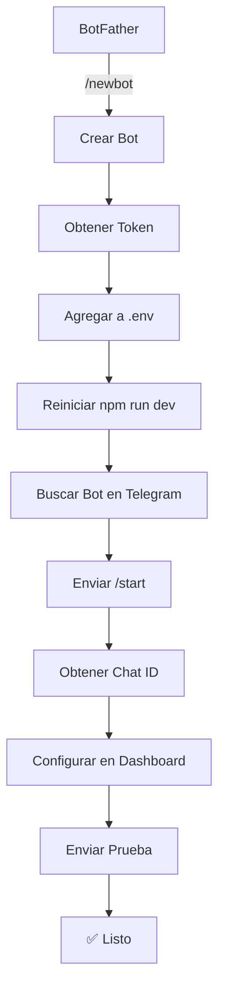

# 🤖 GUÍA DE CONFIGURACIÓN TELEGRAM BOT - DR GROUP

## 📋 Índice
1. [Crear Bot con BotFather](#1-crear-bot-con-botfather)
2. [Obtener Token del Bot](#2-obtener-token-del-bot)
3. [Configurar Variables de Entorno](#3-configurar-variables-de-entorno)
4. [Obtener Chat ID](#4-obtener-chat-id)
5. [Configurar en el Dashboard](#5-configurar-en-el-dashboard)
6. [Testing y Verificación](#6-testing-y-verificación)
7. [Troubleshooting](#7-troubleshooting)

---

## 1️⃣ **Crear Bot con BotFather**

### **Paso 1: Abrir Telegram y buscar @BotFather**
1. Abre la aplicación de Telegram (web, desktop o móvil)
2. Busca `@BotFather` en la barra de búsqueda
3. Inicia una conversación haciendo clic en **"Start"**

### **Paso 2: Crear nuevo bot**
```
/newbot
```

### **Paso 3: Asignar nombre al bot**
BotFather te pedirá:
- **Nombre del bot** (visible para usuarios): `DR Group Notificaciones`
- **Username del bot** (único, debe terminar en "bot"): `drgroup_notificaciones_bot`

✅ **Resultado esperado:**
```
Done! Congratulations on your new bot. You will find it at t.me/drgroup_notificaciones_bot

Use this token to access the HTTP API:
1234567890:ABCdefGHIjklMNOpqrsTUVwxyz

Keep your token secure and store it safely, it can be used by anyone to control your bot.
```

---

## 2️⃣ **Obtener Token del Bot**

Una vez creado el bot, BotFather te proporcionará un **Token de API** como este:

```
1234567890:ABCdefGHIjklMNOpqrsTUVwxyz
```

🔐 **IMPORTANTE:**
- ❌ **NUNCA** compartas este token públicamente
- ❌ **NUNCA** lo subas a Git sin .env
- ✅ **SIEMPRE** guárdalo en variables de entorno

---

## 3️⃣ **Configurar Variables de Entorno**

### **Archivo `.env` (Local)**

Crea o edita el archivo `.env` en la raíz del proyecto:

```bash
# Telegram Bot Configuration
VITE_TELEGRAM_BOT_TOKEN=1234567890:ABCdefGHIjklMNOpqrsTUVwxyz
```

### **Verificar configuración**

```bash
# Windows PowerShell
echo $env:VITE_TELEGRAM_BOT_TOKEN

# Linux/Mac
echo $VITE_TELEGRAM_BOT_TOKEN
```

---

## 4️⃣ **Obtener Chat ID**

Cada usuario necesita su propio **Chat ID** para recibir notificaciones.

### **Método 1: Usando el Bot Directo (Recomendado)**

1. **Busca tu bot en Telegram**: `@drgroup_notificaciones_bot`
2. **Inicia conversación**: Haz clic en **"Start"** o envía `/start`
3. **Envía cualquier mensaje**: Por ejemplo, escribe `Hola`
4. **Usa la API de Telegram** para obtener tu Chat ID:

Abre en tu navegador (reemplaza `TU_TOKEN`):
```
https://api.telegram.org/botTU_TOKEN/getUpdates
```

**Ejemplo:**
```
https://api.telegram.org/bot1234567890:ABCdefGHIjklMNOpqrsTUVwxyz/getUpdates
```

**Respuesta JSON:**
```json
{
  "ok": true,
  "result": [
    {
      "update_id": 123456789,
      "message": {
        "message_id": 1,
        "from": {
          "id": 987654321,  // 👈 ESTE ES TU CHAT ID
          "is_bot": false,
          "first_name": "Juan",
          "username": "juanperez"
        },
        "chat": {
          "id": 987654321,  // 👈 TAMBIÉN AQUÍ
          "first_name": "Juan",
          "username": "juanperez",
          "type": "private"
        },
        "date": 1234567890,
        "text": "Hola"
      }
    }
  ]
}
```

✅ **Tu Chat ID es**: `987654321`

### **Método 2: Usando @userinfobot**

1. Busca `@userinfobot` en Telegram
2. Inicia conversación con **"Start"**
3. El bot te enviará automáticamente tu Chat ID

---

## 5️⃣ **Configurar en el Dashboard**

### **Paso 1: Ir a Gestión de Usuarios**
1. Abre el DR Group Dashboard
2. Navega a **"Usuarios"** en el menú lateral
3. Selecciona el usuario al que quieres configurar notificaciones

### **Paso 2: Abrir Modal de Notificaciones**
1. Haz clic en el botón **"⚙️ Configurar Notificaciones"**
2. Se abrirá el modal de configuración

### **Paso 3: Activar Telegram**
1. **Activa el switch** de Telegram (azul)
2. **Ingresa tu Chat ID** en el campo de texto:
   ```
   987654321
   ```
3. Haz clic en **"▶ Prueba"** para verificar la conexión

### **Paso 4: Seleccionar Tipos de Notificaciones**
Marca las notificaciones que deseas recibir:

✅ **Gestión de Usuarios**
- 👤 Usuario creado
- ✏️ Usuario actualizado
- 🎭 Rol modificado

✅ **Compromisos Próximos a Vencer**
- 📅 15 días antes
- ⏰ 7 días antes
- ⚠️ 2 días antes
- 🚨 Vence hoy

✅ **Compromisos Vencidos**
- 🔴 Vencido (1+ días)

✅ **Pagos y Gestión**
- 💳 Pago registrado
- 🟡 Pago parcial
- ✅ Compromiso completado

✅ **Ingresos**
- 📬 Ingreso recibido

### **Paso 5: Guardar Configuración**
Haz clic en **"⚙️ Guardar Configuración"**

---

## 6️⃣ **Testing y Verificación**

### **Test Manual**

Dentro del modal de configuración:

1. **Telegram activado** ✅
2. **Chat ID ingresado** ✅
3. **Clic en "▶ Prueba"**

**Mensaje esperado en Telegram:**
```
🔔 Prueba de Telegram

¡Hola Juan Pérez! 👋

Tu bot de Telegram está correctamente configurado.

✅ Chat ID verificado
✅ Permisos correctos
✅ Listo para recibir notificaciones

🤖 DR Group Bot • 21/10/2025, 10:30:45 a. m.
```

### **Test Automático (Crear Usuario)**

1. Ve a **Gestión de Usuarios**
2. Crea un nuevo usuario
3. **Deberías recibir** un mensaje en Telegram:

```
🔔 Nuevo Usuario Creado

👤 María González
📧 maria@drgroup.com
🎭 Rol: Administrador
👨‍💼 Creado por: Juan Pérez

DR Group Dashboard
```

---

## 7️⃣ **Troubleshooting**

### **❌ Error: "Chat ID inválido o bot no iniciado"**

**Causa**: No has iniciado conversación con el bot.

**Solución**:
1. Busca `@drgroup_notificaciones_bot` en Telegram
2. Haz clic en **"Start"**
3. Envía cualquier mensaje
4. Vuelve a intentar

---

### **❌ Error: "VITE_TELEGRAM_BOT_TOKEN no configurado"**

**Causa**: Token no está en `.env`.

**Solución**:
```bash
# Verifica que existe el archivo .env
ls -la .env

# Agrega la variable
echo "VITE_TELEGRAM_BOT_TOKEN=TU_TOKEN_AQUI" >> .env

# Reinicia el servidor de desarrollo
npm run dev
```

---

### **❌ Error: "Unauthorized" (401)**

**Causa**: Token inválido o revocado.

**Solución**:
1. Ve a @BotFather en Telegram
2. Envía `/token`
3. Selecciona tu bot
4. Copia el nuevo token
5. Actualiza `.env`

---

### **❌ No llegan las notificaciones**

**Checklist de verificación**:

```
✅ Token correcto en .env
✅ Chat ID correcto (sin espacios ni caracteres extra)
✅ Bot iniciado con /start
✅ Switch de Telegram activado (azul)
✅ Tipos de notificaciones seleccionados
✅ Configuración guardada
✅ Servidor de desarrollo reiniciado
```

---

## 🎯 **Flujo Completo de Configuración**



---

## 📚 **Referencias y Recursos**

### **Documentación Oficial**
- [Telegram Bot API](https://core.telegram.org/bots/api)
- [BotFather Commands](https://core.telegram.org/bots#botfather)

### **Herramientas Útiles**
- [@userinfobot](https://t.me/userinfobot) - Obtener tu Chat ID
- [Telegram Web](https://web.telegram.org/) - Usar en navegador
- [Bot API Testing](https://api.telegram.org/bot) - Endpoint de testing

### **Comandos de BotFather**
```
/mybots - Ver tus bots
/newbot - Crear nuevo bot
/token - Ver/regenerar token
/setdescription - Cambiar descripción
/setuserpic - Cambiar foto de perfil
/deletebot - Eliminar bot
```

---

## ✅ **Checklist Final**

Antes de considerar la implementación completa:

- [ ] Bot creado con @BotFather
- [ ] Token configurado en `.env`
- [ ] Variable de entorno verificada
- [ ] Servidor reiniciado (`npm run dev`)
- [ ] Bot iniciado con `/start` en Telegram
- [ ] Chat ID obtenido correctamente
- [ ] Chat ID configurado en Dashboard
- [ ] Test manual exitoso (▶ Prueba)
- [ ] Test automático exitoso (crear usuario)
- [ ] Notificaciones llegando correctamente

---

## 🎉 **¡Configuración Completada!**

Tu sistema de notificaciones por Telegram está **100% funcional**. Ahora recibirás notificaciones instantáneas de:

✅ Gestión de usuarios  
✅ Compromisos próximos a vencer  
✅ Compromisos vencidos  
✅ Pagos y gestión  
✅ Ingresos recibidos  

**Siguiente paso**: Configura EmailJS para tener un sistema dual de notificaciones (Telegram + Email). 📧🤖
